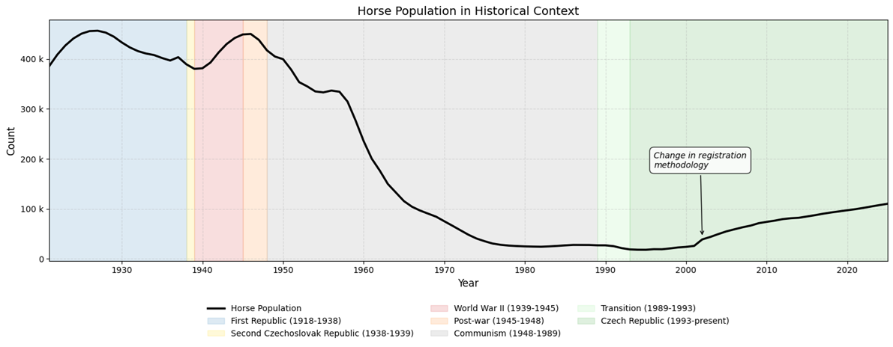
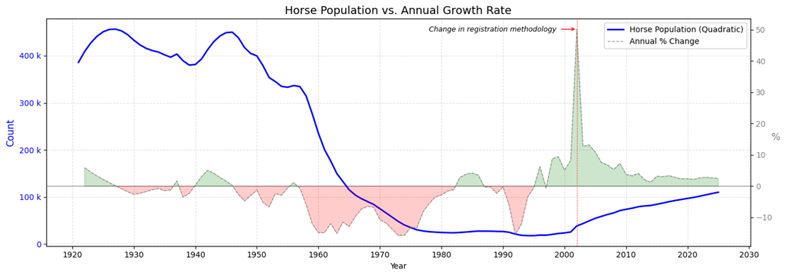
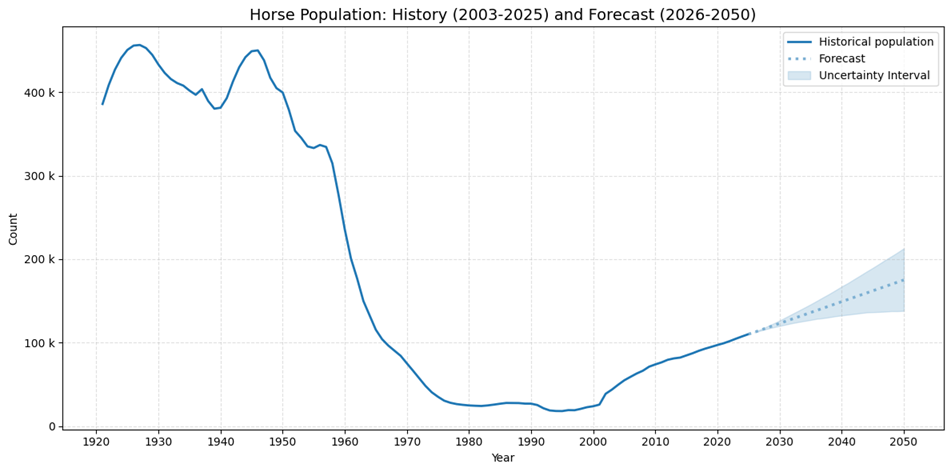

# Visual Assets: Analytical Plots & Key Insights

This directory contains the main visualizations generated during the equine population analysis. These plots are used to communicate the historical context, technical findings, and predictive outcomes of the project.

## 📊 Main Visualizations

### 1. historical_context.png
*   **Description:** A comprehensive view of the horse population trend from 1921 to 2025.
*   **Analytical Value:** This plot maps demographic data against significant socio-political eras (e.g., First Republic, WWII, the Communist era, and the Modern Czech Republic). 
*   **Key Insight:** It visually demonstrates the correlation between agricultural mechanization/collectivization and the 96% population collapse observed between 1947 and 1995.       

### 2. population_and_growth.png
*   **Description:** A dual-axis chart representing the absolute horse count alongside the annual growth rate (percentage change).
*   **Analytical Value:** This visualization is critical for identifying the **2002 structural break**. 
*   **Key Insight:** The extreme spike in the growth rate in 2002 highlights the transition to the Central Register of Horses (ÚEK) methodology, proving that the jump was administrative rather than biological.       

### 3. history_and_forecast.png
*   **Description:** The final consolidated view showing reconstructed historical data (1921–2025) and the Prophet model's projection up to 2050.
*   **Analytical Value:** Seamlessly bridges the empirical historical data directly with the model's future estimates. It highlights the baseline forecast and its **80% uncertainty interval** providing a clear executive view of the expected trajectory without the visual clutter of training fit lines.
*   **Key Insight:** Visualizes the expected trajectory toward 175,000 horses by 2050, assuming the current socio-economic trend of horses as companion animals continues.      
       

---

## 📈 Additional Visualizations in the Notebook
While this directory highlights the final executive visualizations, the main Jupyter Notebook (`01_population_analysis.ipynb`) contains a comprehensive suite of working charts used throughout the analytical process. These include:

*   **Interpolation Diagnostics:** Visual comparisons of linear vs. polynomial interpolations, alongside rolling window cross-validation boxplots and residual histograms used to select the optimal model.
*   **Prophet Diagnostics:** Plots showing Prophet's internal trend changepoints, model fit overlays on historical data, and performance metric charts (MAPE vs. Coverage) utilized during hyperparameter tuning (`changepoint_prior_scale`).
*   **Decline & Growth Phases:** Detailed scatter and line plots isolating continuous periods of population decline and growth for granular analysis.

---

## 🛠️ Technical Details
*   **Generation:** All plots were programmatically generated within the `01_population_analysis.ipynb` notebook.
*   **Libraries:** `Matplotlib` for core plotting and `Seaborn` for statistical styling.

---
